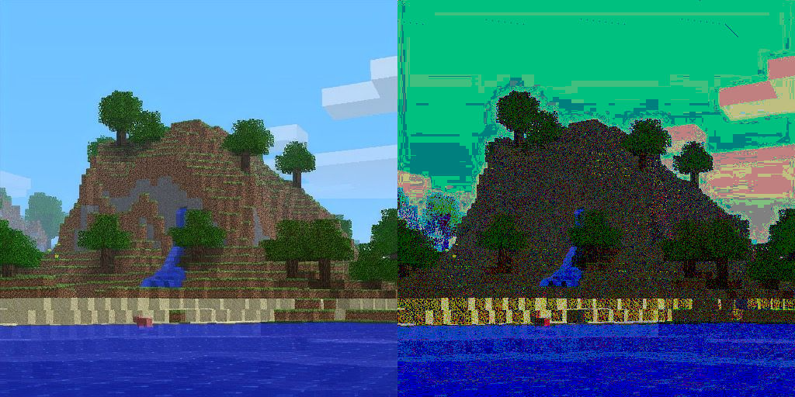

# hacking-DVI
messing with the DVI cable encoding to make glitch art >:3

by: [@NucleicAcidTest@tech.lgbt](https://tech.lgbt/@NucleicAcidTest) and [@cqql@tech.lgbt](https://tech.lgbt/@cqql)

- notes: [notes.md](./notes.md)
- code: [main.rs](/src/main.rs)
- context: [fedi posts](https://tech.lgbt/@cqql/113940687396304966), [bluesky posts](https://bsky.app/profile/did:plc:4noczn65i6b47cmqr7ulqqqk/post/3li3e2wg4fk2x)
- DVI specsheet: https://glenwing.github.io/docs/DVI-1.0.pdf
